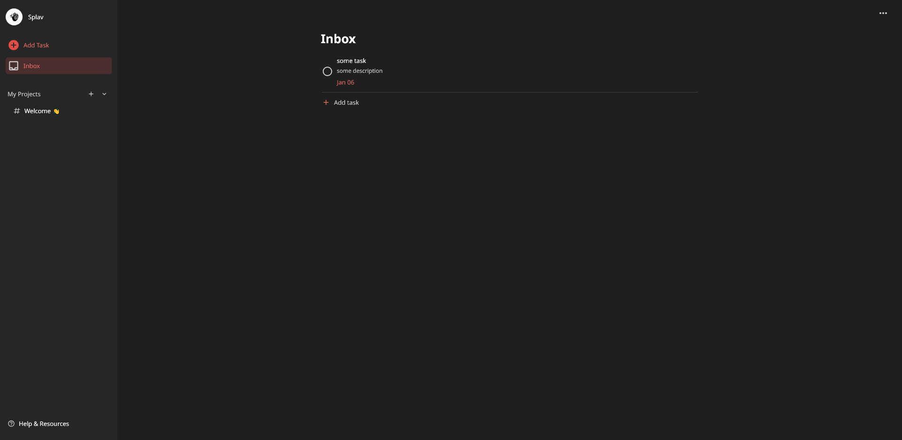
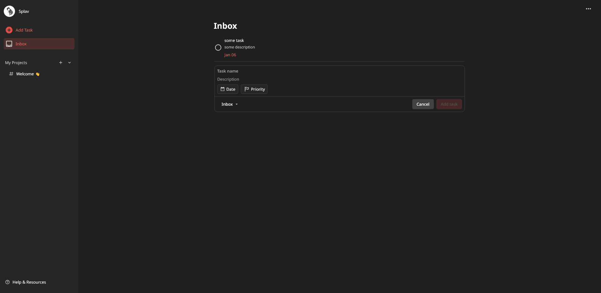
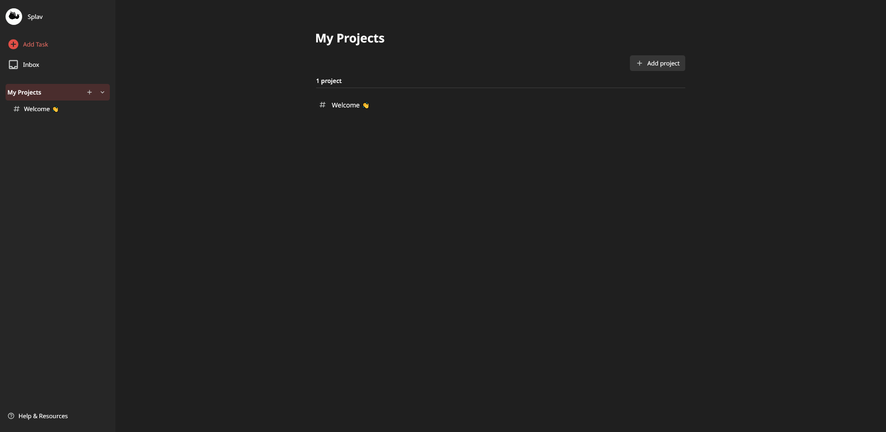
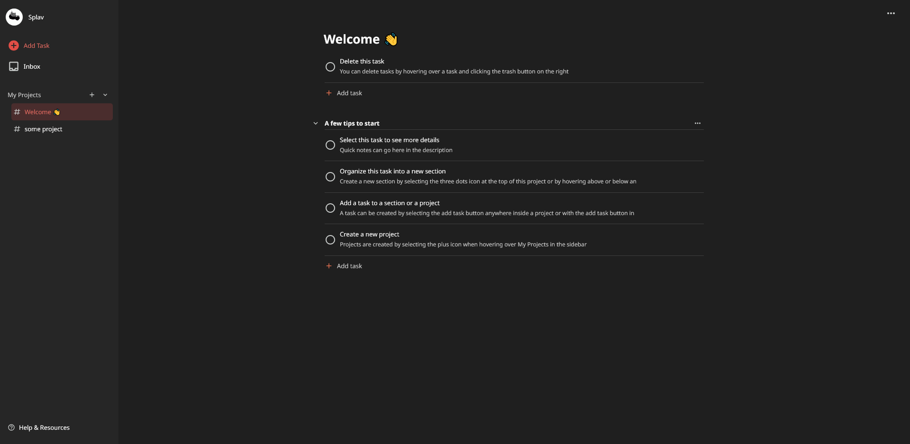
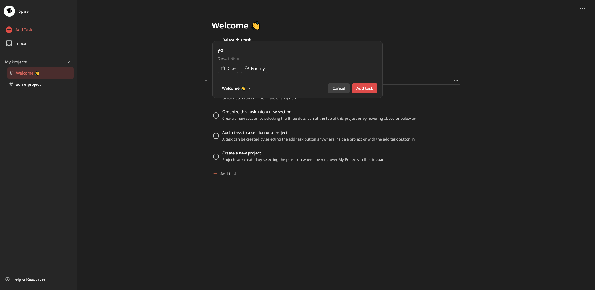

# Todoist Clone
It's what it sounds like, a basic clone of the popular to-do list application [Todoist.com](https://www.todoist.com/home). 

More specifically, this repository attempts to clone the web application of the Todoist app. This verison of the app is unique since it was developed using only TypeScript, HTML, and CSS, no frameworks. To emulate single page application behavior provided by React, each "webpage" and their content is managed solely by vanilla TypeScript. As a styling challenge, the styling of every web component was styled with vanilla CSS instead of a CSS framework like Tailwind or something similar.

#### Notable Missing Features
- Search functionality
- Account creation
- Actual backend (state is being persisted through Web Storage API)
- Subprojects
- Subtasks
- Task filters
- Task comments
- Importing CSV data
- Exporting to CSV
- Project templates
- Calander connectivity
- Different display layout options
- Different color theme options
- General application settings
- Project colors
- Notification functionality

## Preview

## Credits
- Project Idea Credit: The Odin Project
- App Icons: Pictogrammers' Material Design Icons
